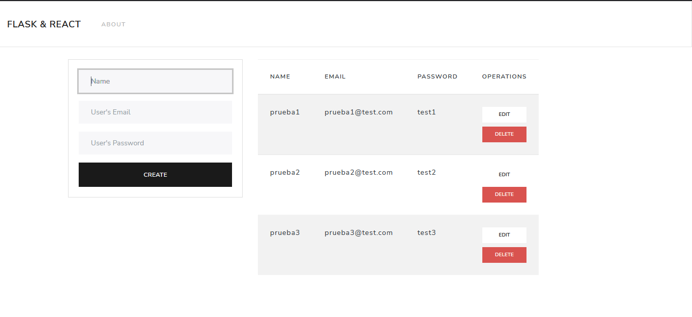

# Flask React MongoDB CRUD
Este repositorio contiene tanto el código de Backend y Frontend de una  aplicación web

Comandos para iniciar la aplicación:

1. Creación del entorno virtual: `virtualenv venv`
2. Instalación de los modulos en el entorno virtual: `pip install flask Flask-PyMongo flask-cors`
3. Activar el entorno virtual: `.\venv\Scripts\activate.bat`
4. Ejecutar el script app.py: `python src/app.py`
5. Aplicación de React: `npm start` 